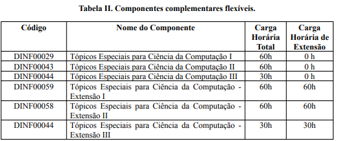

# Complementares Flexíveis

Continuando o papo sobre as complementares flexíveis... Mas afinal como podemos completar ela? Aqui trazemos uma tabela de matérias específicas e atividades e seus respectivos aproveitamentos e documentos necessários para a dispensa!

## Matérias

Essas matérias de “Tópicos especiais” não possuem ementa certa, os tópicos abordados mudam a cada período. Geralmente no período de matrícula o assunto é informado via e-mail.

## Atividades

