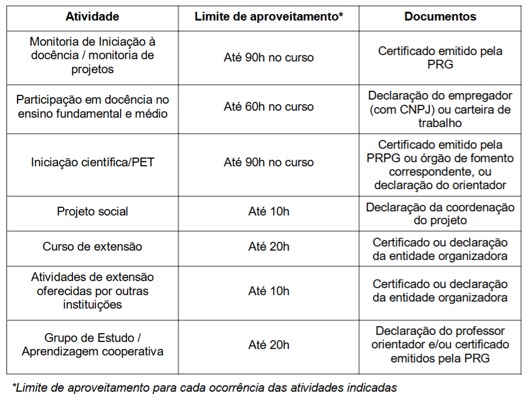
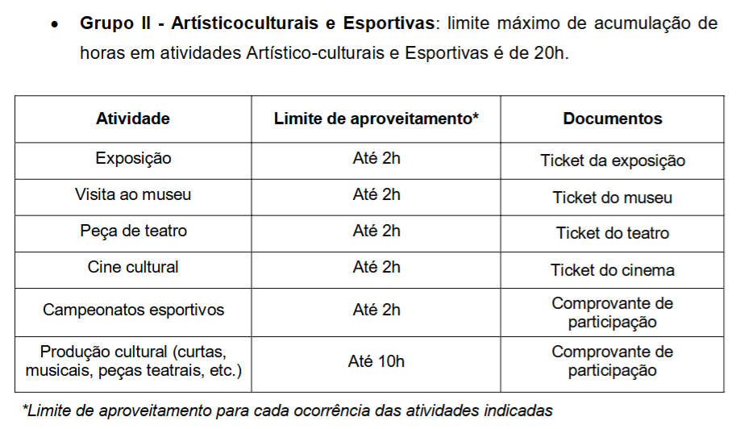
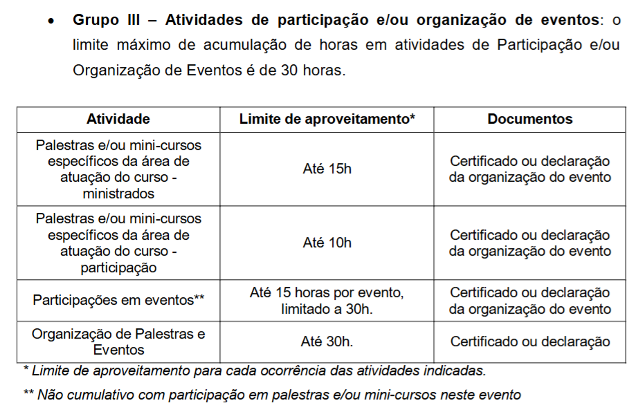
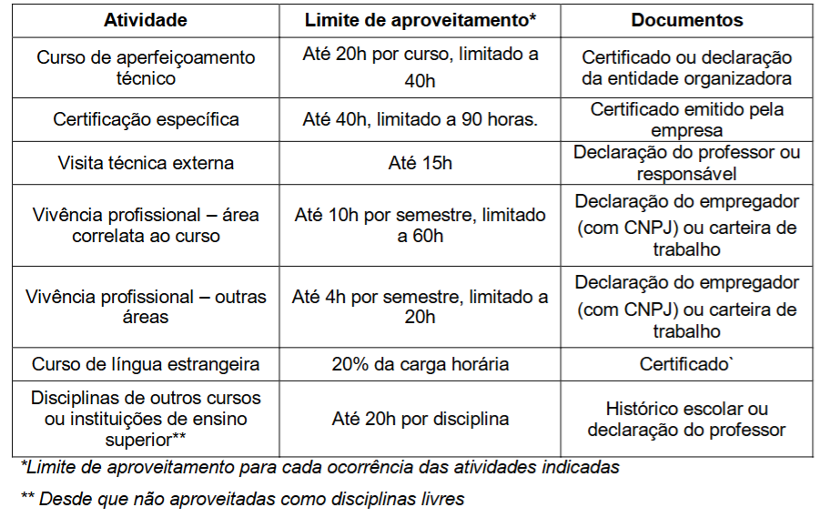
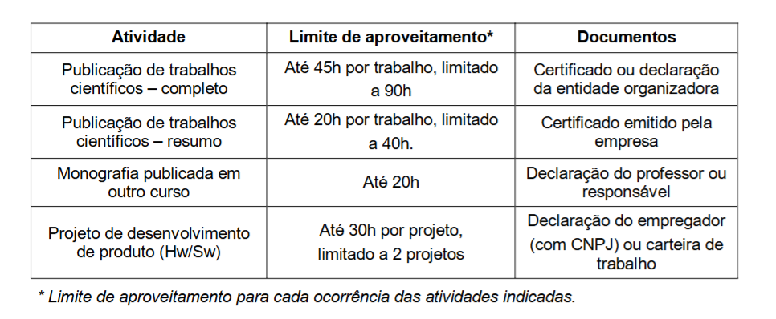
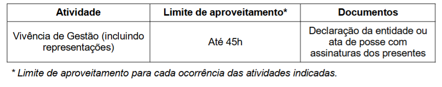

# Complementares Flexíveis

Continuando o papo sobre as complementares flexíveis... Mas afinal como podemos completar ela? Aqui trazemos uma tabela de matérias específicas e atividades e seus respectivos aproveitamentos e documentos necessários para a dispensa!

## Matérias

Essas matérias de “Tópicos especiais” não possuem ementa certa, os tópicos abordados mudam a cada período. Geralmente no período de matrícula o assunto é informado via e-mail.

## Atividades
Grupo I - Atividades de iniciação à docência, à pesquisa e/ou à extensão:
o limite máximo de acumulação de horas em atividades Iniciação à Docência, à Pesquisa e/ou à Extensão é de 90h

Grupo II - Artístico-culturais e Esportivas: limite máximo de acumulação de horas em atividades Artístico-culturais e Esportivas é de 20h.

Grupo III – Atividades de participação e/ou organização de eventos: o limite máximo de acumulação de horas em atividades de Participação e/ou Organização de Eventos é de 30 horas.

Grupo IV – Experiências ligadas à formação profissional e/ou correlatas: o limite máximo de acumulação de horas em atividades de Experiências ligadas à Formação Profissional e/ou Correlatas é de 60 horas.

Grupo V – Produção Técnica e/ou Científica: limite máximo de acumulação de horas em atividades de Produção Técnica e/ou Científica é de 90 horas.

Grupo VI – Vivências de Gestão: limite máximo de acumulação de horas em atividades de Vivências de Gestão é de 45 horas.

Grupo VII – Outras atividades: o limite máximo de acumulação de horas para este conjunto de atividades é de 45 horas.